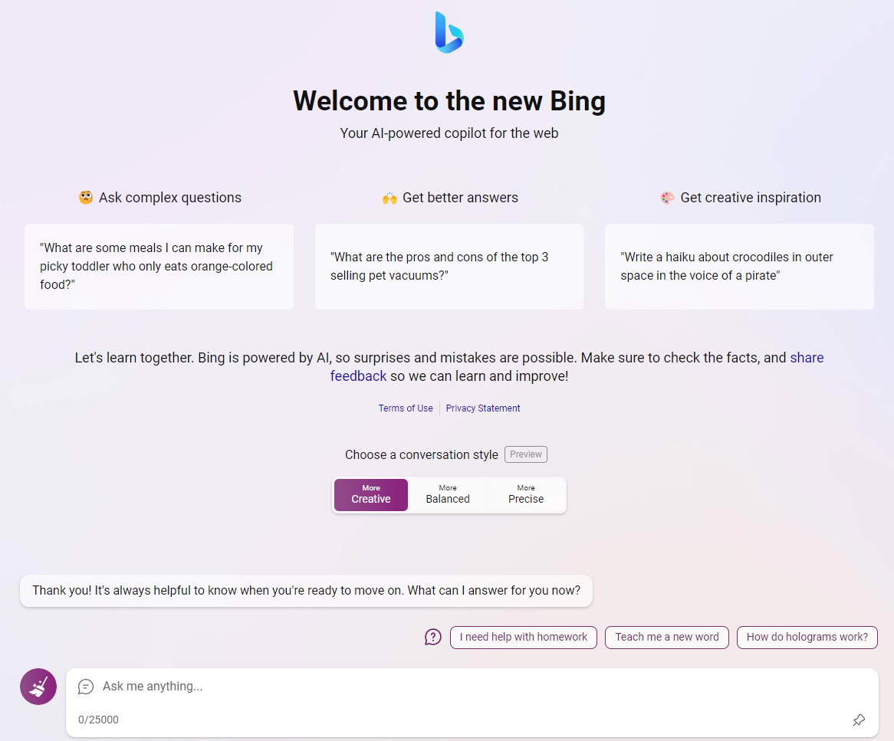

 

Extension to Bybass Bing Chat token limit to 25k, inspired by [this post](https://www.reddit.com/r/bing/comments/12ph7le/how_to_set_the_text_limit_on_bing_chat_to_25000/)

# Installation
1- Download the extension from [here](https://github.com/0ssamaak0/Super-Bing/archive/refs/heads/master.zip)

2- Unzip the extension

3- Open Edge Extensions or simply go Go to `edge://extensions`

3- Enable Developer Mode

4- Click on Load Unpacked

5- Select the folder you unzipped the extension in

Note: it works in bing chat main page, and you have to wait for the page content to be loaded, then you will see the word limit change to 25000.

# Disclaimer
This extension is not affiliated with Microsoft or Bing in any way, and it's not illegal since the Discover button can handle large pages and it's not a violation of the terms of service.

if it caused any problems I can remove it, just let me know.